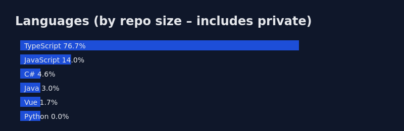

# Jorge Cura

**Senior Backend & Distributed Systems Engineer**

```csharp
public class Engineer : IPolyglot, IArchitect
{
    public string Name       => "Jorge Cura";
    public string Philosophy => "Language Agnostic — the right tool for the job";
    public string Focus      => "Deterministic Systems & Context Engineering";
}
```

---

## About

7+ years building high-availability payment processors, developer tooling, and distributed systems. Language agnostic by design — deep roots in .NET, but I pick the right runtime for the problem: **Rust** for local-first performance, **Python** for data pipelines, **C#** for enterprise stability. Everything I ship is **idempotent, fault-tolerant, and observable**.

---

## Experience

**Senior Software Engineer** | **InComm Payments** | *<!-- dates, e.g. 2022 – Present -->*
- Designed custom idempotency layers for payment orchestration, preventing double-charges across network retries
- Led zero-downtime migration from legacy monolith to modular Vue 3 micro-frontends
- Built and maintained high-throughput transaction processing services on .NET

**Software Engineer** | **RT²** | *<!-- dates, e.g. 2019 – 2022 -->*
- Developed payment rails handling millions in monthly transaction volume
- Implemented event-sourced architectures with distributed locking (RedLock) for consistency guarantees
- Drove adoption of CI/CD pipelines and containerized deployments (Docker, GitHub Actions)

<!-- Add earlier roles here -->

---

## Technical Skills

| Domain | Stack |
| :--- | :--- |
| **Backend** | C# (.NET), Python, Rust |
| **Systems** | Distributed Locking (RedLock), Event Sourcing, Idempotency Patterns |
| **Frontend** | Vue.js 3 (Composition API), TypeScript, Pinia, Tailwind CSS |
| **Data** | SQL Server, PostgreSQL, Redis, MongoDB |
| **Infrastructure** | Azure, AWS (ECS), Docker, GitHub Actions |

---

## Featured Projects

### Project Desk App — Local-First Tooling
*Bridging local filesystems and LLM reasoning.*
- **Stack:** Rust (backend), Tauri v2, Vue 3, Tiktoken-rs
- Recursive filesystem traversal in Rust — 10x throughput vs. Node
- Deterministic JSON-to-File patcher enabling LLM-assisted code refactoring with human-in-the-loop gates

### Enterprise Payment Orchestration — InComm / RT²
*Infrastructure for millions in transactions.*
- Custom idempotency layers ensuring exactly-once semantics across retries
- Zero-downtime monolith-to-micro-frontend migration (Vue 3)

---

## GitHub Activity

<p align="center">
  
  <br />
  
</p>

<details>
<summary><strong>Bonus: System.Runtime.Caffeine</strong></summary>
<br />

I treat coffee brewing like a deployment pipeline — precise variables, consistent execution, constant debugging. Following the James Hoffmann school of thought.

| Method | Dose | Water | Grind | Key Step |
| :--- | :--- | :--- | :--- | :--- |
| **Aeropress** | 11 g | 200 g @ 100 °C | Medium-Fine | Steep 2 min, swirl, gentle press |
| **V60** | 15 g | 250 g @ 100 °C | Medium | 50 g bloom, single pour to 250 g, swirl |

</details>

---

## Connect

- [LinkedIn](https://linkedin.com/in/jorgecura)
- [Email](mailto:curajorge21@gmail.com)
